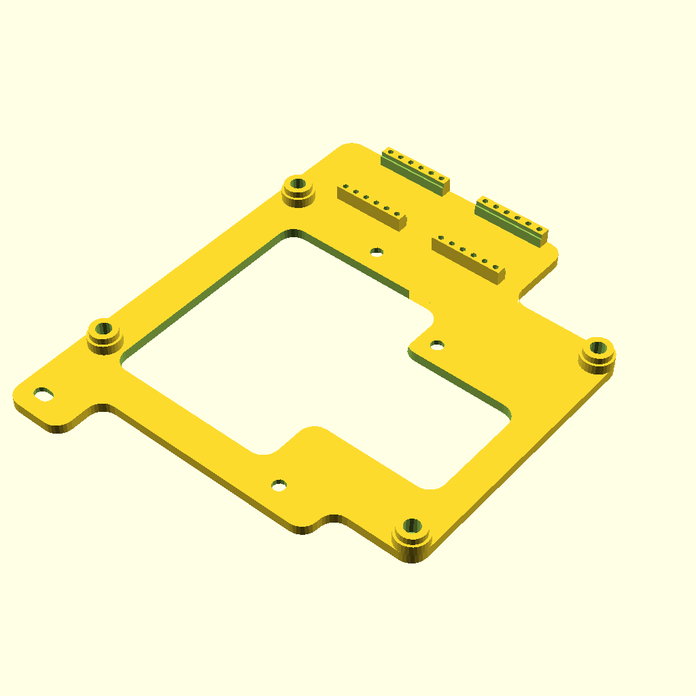
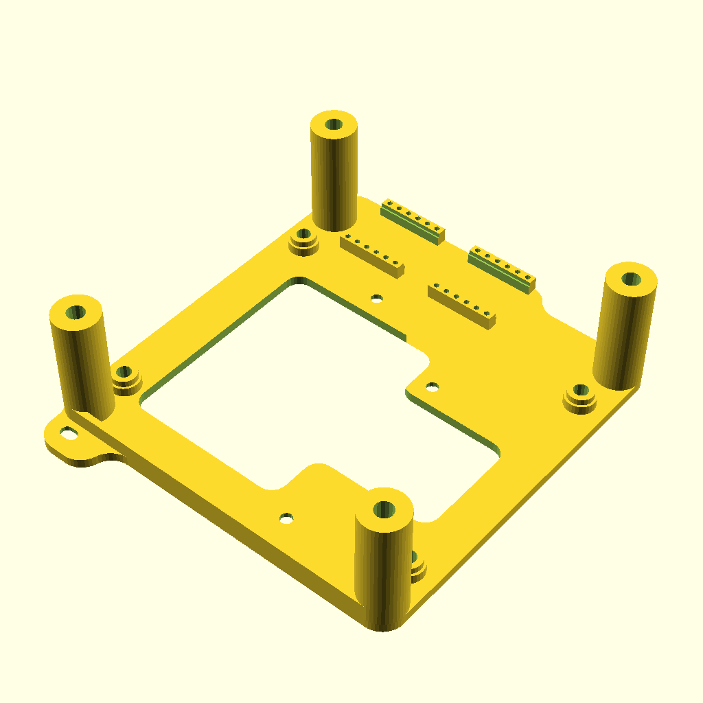
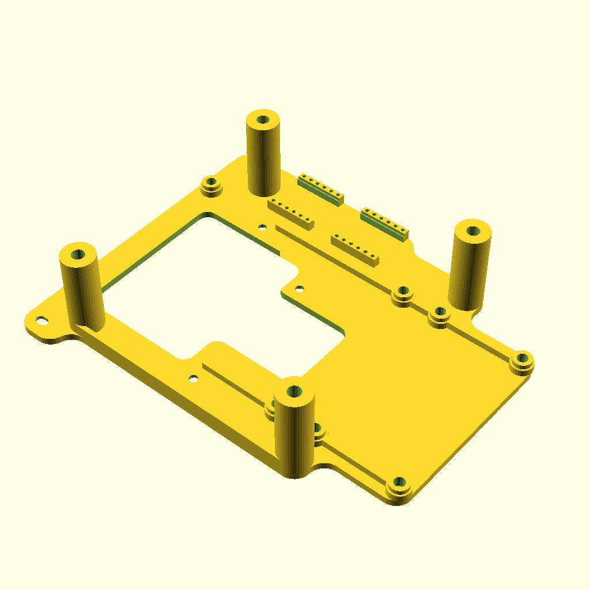
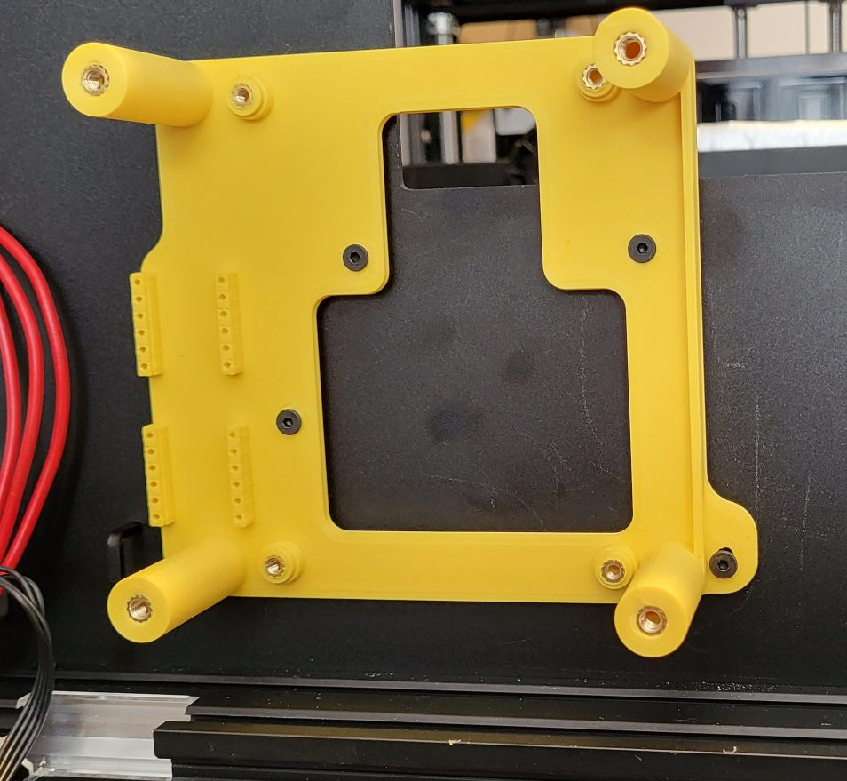
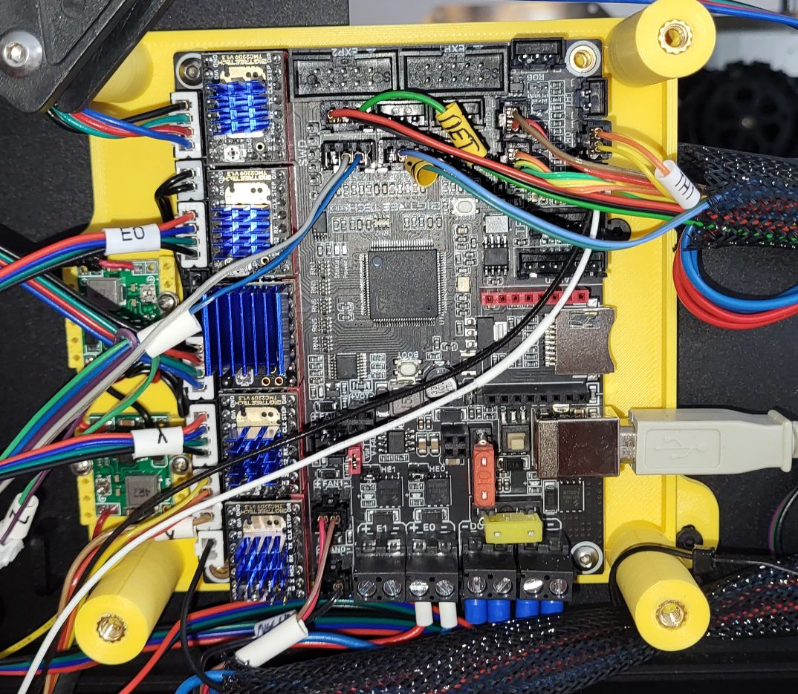
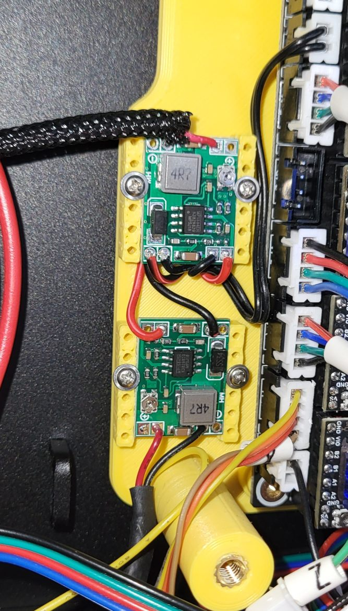
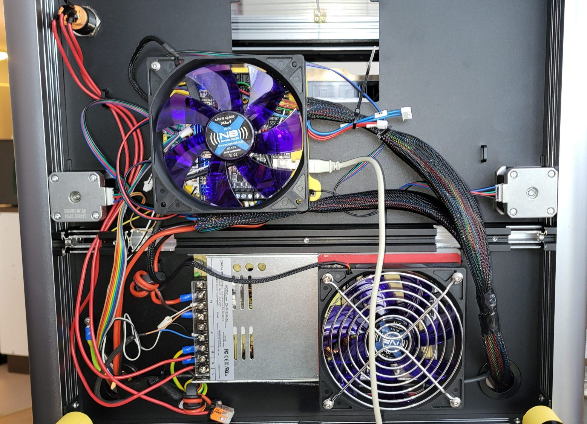

# SKR3SermoonD1Klipper
Klipper settings for BTT SKR3 built into the Creality Sermoon D1

## Status
Printer works fine and I think not much will come anymore from my side.
The reason is that I switch to another board (MKS Monster8). It is not the fault of the SKR3 board which is a very fine board with very good documentation and a fair price.

However I want to add an auxilary feeder (extruder) that ensures the filament gets feed correctly into the direct extruder. Currently I sometimes have issues with material transport and get under extrusion. For that extra stepper motor it needs an extra driver, one too much for the SKR3. Yes, there is the Ext-M board that can extend the SKR3 with 3 more axes. I even created a mounting holder that can carry an EXT board. Unfortunatelly none of the stores I checked (many!) could deliver this board with reasonable delivery time. Since I can re-use the SKR3 in another project, I decided to go with a board with at least one more axis. The MKS Monster8 is small enough to fit easily underneath the fan. (The Octopus board is quite a bit wider).
Find my repo for the Monster8 here: https://github.com/FauthD/MksMonster8V2SermoonD1Klipper .

## Mechanics
Created an adapter to mount the SKR 3 since it does not fit to the mounting holes in the Sermnoon D1. Later I added some mounts for a big 120mm fan (because it was easier with a fan larger than the board). The fan runs with about 600 rmp and is barly audible.

Since I planed to add an extra stepper for a auxilary feeder, some space for the BTT Exp board was neccessary. Find the .stl and .scad files in directory SKR3-Adapter and below.

| No fan | 120mm fan | 120mm fan + ext board |
| :----: | :----: | :----: |
|  |  | 

Note: You either need to cut a hole onto the bottom sheet or replace it with some new bottom and larger feet. (Due to the board change I will not design a new bottom sheet for this board.)

Note2: The original mainboard fan does not transport much air, but makes quite some noise. So a slow turning 120mm fan running at 7V is much better.
The next source of noise is the fan in the power supply. I replaced that fan with a low noise 120mm fan running from 12V. Now it is barly audible and still produces a much better airflow. PSU stays cool even for long prints.
Both the 12V and the 7V are generated by cheap (0.7€+shipping) step down regulators. They are mounted onto the adapter.

Note3: We need heigher feet. Already printed some test feet with 28mm height (need 40mm screws - probably will increase by 5mm when I have that screws available).

Note4: I cannot check whether the original wires are long enough since I did buy the printer used and the wires are not original anymore.

### Rebuilding the .stl files
You need openscad installed.

On Linux, navigate into the directory SKR3-Adapter, open a cmd line and run make.

On Windows you also need some version of gmake installed. I do not use Windows anmore, so you are on your own.

### Photos:

| Adapter | Mainboard | Step down regulators | Total |
| :----: | :----: | :----: | :----: |
|  |  |  |  |

## Klipper
Installed MainsaleOS on a RPi, created the firmware and flashed.
X and Y axis work including the limit switches.

CR Touch is working fine.
Even the Z-Tilt option works very nice.
Z Axis is much more silent (one reason I did all this, the original drivers for Z are very noisy).

X and Y axis have some resonances when they move fast. Turning stealthchop on reduced the resonances a lot.

Extruder works and is calibrated.

Bed mesh works (I am not happy with my bed yet).

A test with a LED RGB ring was succesful, but this is merly an example.

Note: I had issues with the Z axes (suddenly lots of noise, intermediatly running in wrong direction). To hunt this I added an extra SKR 3 E3 mini board for the Z Axes (Klipper is so flexible).

At the end it turned out that the (new) cables to the steppers are faulty and provided not always a good contact. After replacing these, all was fine.

Now I am back to the SKR 3 only, but the extra lines for the Mini 3E are still there as comments.

