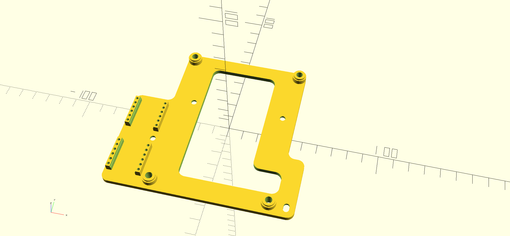
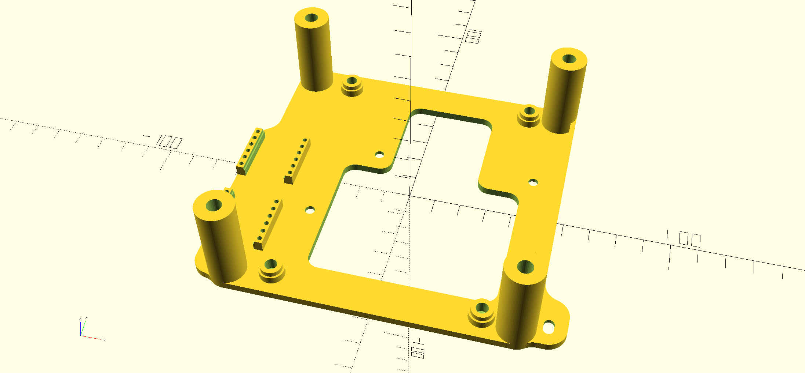

# SKR3SermoonD1Klipper
Klipper settings for BTT SKR3 build into the Creality Sermoon D1

This is WIP, do not use it yet.
I will add details here when it is ready and works.

# Progress

## Mechanics
Created an adapter to mount the SKR 3 since it does not fit to the mounting holes.

| No fan | With 120mm fan |
| :----: | :----: |
|  |  |

Note: You either need to cut a hole onto the bottom sheet or replace it with something new (my plan).

Note2: The original mainboard fan does not transport much air, but make quite some noise. So a slow turning 120mm fan is much better.
The next source of noise is the fan in the power supply. With my Ender 3 V2 I replaced that fan with a low noise 92mm fan. Now it is barly audible.

Note3: We need heigher feet. Already printed some test feet with 28mm height (need 40mm screws - probably will increase by 5mm when I have that screws available).

Note4: I cannot check whether the original wires are long enough since I did buy the printer used and the wires are not original anymore.
## Klipper
Installed Mainsaleos on a RPi, created the firmware and flashed.
X and Y axis work including the limit switches.

Next is Z axis... CR Touch.
